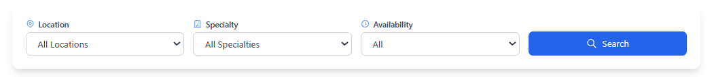

# Doctor Booking UI

A responsive and accessible appointment booking interface for healthcare platforms. This project focuses on front-end implementation with emphasis on user experience, accessibility, and code quality.

## Features

- **Doctor Directory View**
  - List of doctors with details (name, photo, specialty, availability, location)
  - Filter doctors by specialty, location, and availability
  - Book appointment button for each doctor

- **Booking Modal**
  - Opens when clicking "Book Appointment"
  - Displays doctor information and available time slots
  - Form for patient details and appointment confirmation

- **Appointments Summary**
  - View all booked appointments
  - Display doctor details, appointment time, and location
  - Clean and organized layout

## Screenshots

### Doctor Directory View


### Filter Bar


### Booking Modal


### Appointments Summary


## Tech Stack

- React 19
- JavaScript
- TailwindCSS for styling
- Zustand for state management
- HTML5
- CSS3

## Accessibility Features

- Keyboard navigation support
- ARIA labels and roles
- Responsive design for all screen sizes
- Semantic HTML structure
- Focus management in modals
- Clear visual hierarchy

## Getting Started

1. Clone the repository:
```bash
git clone https://github.com/yourusername/doctor-booking-ui.git
```

2. Install dependencies:
```bash
cd doctor-booking-ui
npm install
```

3. Start the development server:
```bash
npm start
```

4. Open [http://localhost:3000](http://localhost:3000) to view it in your browser.

## Project Structure

```
src/
├── components/         # React components
├── stores/            # Zustand state management
├── data/              # Mock data
├── App.js             # Main application component
└── index.js           # Entry point
```

## AI Tools Usage

This project utilized AI assistance through Cursor for:
- Component scaffolding
- Mock data generation
- Accessibility optimization
- Code review and improvements
- README documentation

## Known Limitations

- No backend integration (mock data only)
- No user authentication
- No persistent storage
- Limited appointment management features

## Next Steps

- Add user authentication
- Implement persistent storage
- Add appointment cancellation feature
- Integrate with a backend API
- Add more filtering options
- Implement appointment reminders
- Add doctor reviews and ratings system

## Contributing

Contributions are welcome! Please feel free to submit a Pull Request.

## License

This project is licensed under the MIT License - see the LICENSE file for details.
